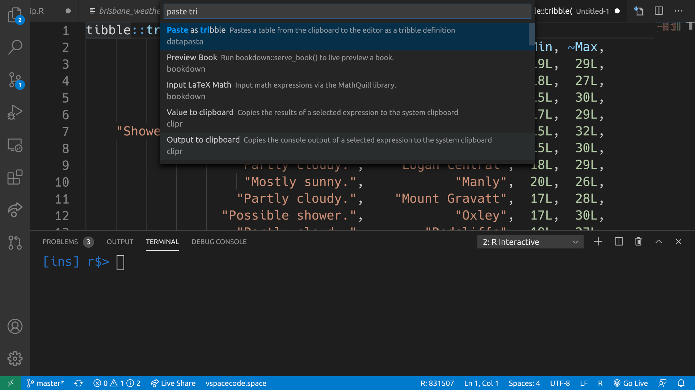

# R support for Visual Studio Code
[](https://aka.ms/vsls)

Requires [R](https://www.r-project.org/).

We recommend using this extension with [radian](https://github.com/randy3k/radian), an alternative R console with multiline editing and rich syntax highlighting.

## Usage

Full document is on the [Wiki page](https://github.com/Ikuyadeu/vscode-R/wiki)

* For Windows, if `r.rterm.windows` is empty, then the path to `R.exe` will be searched in Windows registry. If your R is not installed with path written in registry or if you need a specific R executable path, set it to a path like `"C:\\Program Files\\R\\R-3.3.4\\bin\\x64\\R.exe"`.
* For Radian console, enable config `r.bracketedPaste`
* Open your *folder* that has R source file (**Can't work if you open only file**)
* Use `F1` key and `R:` command or `Ctrl+Enter` (Mac: `⌘+Enter`)

## Features

* Run Source(`Ctrl+Shift+S` or Push icon) and Run Selected Line (`Ctrl+Enter`) (Mac: `Ctrl` to `⌘`)
* Run functions:
  * `nrow` (`Show number of rows for selected object`)
  * `length` (`Show length for a selected object`)
  * `head` (`Show first part of a selected object`)
  * `thead` (`Show first part of a selected object (transposed)`)
  * `names` (`Show names for a selected object`)


* R Integrated Terminal


* Run all commands in terminal containing existing R session (enable config `r.alwaysUseActiveTerminal`)

* Extended Syntax(R, R Markdown, R Documentation)


* Create .gitignore based [R.gitignore](https://github.com/github/gitignore/raw/master/R.gitignore)

* Data frame viewer and Environment viewer(`Preview Data frame` or `Preview Environment`)


* Snippets

* Package development short cut (`Load All`, `Test Package`, `Install Package`, `Build Package` and `Document`)

* Bind keys to custom R commands using command runner functions (`r.runCommand`, `r.runCommandWithEditorPath`, `r.runCommandWithSelectionOrWord`)

* RStudio Addins - a subset of the `{rstudioapi}` is supported (detail is [here](https://github.com/Ikuyadeu/vscode-R/wiki/RStudio-addin-support))



## Requirements

* R base from <https://www.r-project.org/>

## Extension Settings

This extension contributes the following settings:

* `r.rterm.windows`: set to R.exe path for Windows
* `r.rterm.mac`: set to R term's path for Mac OS X
* `r.rterm.linux`: set to R term's path for Linux
* `r.rpath.lsp`: set to R.exe path for Language Server Protocol
* `r.rterm.option`: R command line options (i.e: --vanilla)
* `r.source.encoding`: An optional encoding to pass to R when executing the file
* `r.source.focus`: Keeping focus when running (editor or terminal)
* `r.alwaysUseActiveTerminal`: Use active terminal for all commands, rather than creating a new R terminal
* `r.bracketedPaste`: For consoles supporting bracketed paste mode (such as Radian)
* `r.sessionWatcher`: Enable R session watcher (experimental)
* `r.rtermSendDelay`: Delay in milliseconds before sending each line to rterm (only applies if r.bracketedPaste is false)
* `r.rmarkdown.enableCodeLens`: Enable RMarkdown CodeLens, which are inline commands/buttons e.g. 'Run Chunk | Run Above' shown on the first line of each code chunk.
  <details>
    <summary>Details</summary>

  * Click the buttons to run commands.
  * Hover on the buttons to show tooltips.
  * CodeLens commands are customizable via settings UI (Rmarkdown: Code Lens commands) or settings.json `r.rmarkdown.codeLensCommands`
  </details>
* `r.rmarkdown.codeLensCommands`: Customize RMarkdown CodeLens, which are inline commands/buttons e.g. 'Run Chunk | Run Above' shown on the first line of each code chunk. <details>
    <summary>Details</summary>
    Available commands:

  * `r.selectCurrentChunk`
  * `r.runCurrentChunk`
  * `r.runAboveChunks`
  * `r.runCurrentAndBelowChunks`
  * `r.runBelowChunks`
  * `r.runAllChunks`
  * `r.runPreviousChunk`
  * `r.runNextChunk`
  * `r.goToPreviousChunk`
  * `r.goToNextChunk`
    <br>

    Customize both the commands AND its orders (that is, CodeLens respect user-specified orders). Default commands:
  * `r.runCurrentChunk`
  * `r.runAboveChunks`
  * `<Add item...>`
  </details>
* `r.rmarkdown.chunkBackgroundColor:` RMarkdown chunk background color in RGBA or RGB value.
  <details>
  <summary>Details</summary>
    Defaults to rgba(128, 128, 128, 0.1). Leave it empty to disable it (use default editor background color). Reload VS Code after changing settings. Learn how to set colors: https://www.w3schools.com/css/css_colors_rgb.asp
    <br><br>

    Examples for syntax `rgba(<red>, <green>, <blue>, <alpha>)`:
  * `rgba(128, 128, 128, 0.1)`
  * `rgba(128, 128, 128, 0.3)`
  * `rgba(255, 165, 0, 0.1)`
  </details>

* Language server(developing [here](https://github.com/REditorSupport/languageserver))

## R Session Watcher (Experimental)

*This experimental feature is still under development and the behavior
**may change without notice**. Please file an issue [here](https://github.com/Ikuyadeu/vscode-R/issues) if you experience problems or have any suggestions.*

An opt-in experimental R session watcher is implemented to support the following features:

* Watch any R session
* Show value of session symbols on hover
* Provide completion for session symbols
* `View()` any objects including data frames and list objects
* Show plot output on update and plot history
* Show htmlwidgets, documentation and shiny apps in WebView
* Execute RStudio addins

### Basic usage

To enable this feature, turn on `r.sessionWatcher` in VSCode settings, reload or restart VSCode, and the session watcher will be activated automatically
on R sessions launched by vscode-R via `R: Create R Terminal` command.

*If you previously appended the `source(...)` line to `~/.Rprofile`, you may safely remove it since the configuration for basic usage is automated. It is
now only necessary for advanced usage described below.*

### Advanced usage (for self-managed R sessions)

For advanced users to work with self-managed R sessions (e.g. manually launched R terminal or started in `tmux` or `screen` window), some extra
configuration is needed. Follow the steps below to make R session watcher work with any external R session:

1. Turn on `r.sessionWatcher` in VSCode settings.
2. Edit `.Rprofile` in your home directory by running the following code in R:

    ```r
    file.edit("~/.Rprofile")
    ```

3. Append the following code to the file:

    ```r
    source(file.path(Sys.getenv(if (.Platform$OS.type == "windows") "USERPROFILE" else "HOME"), ".vscode-R", "init.R"))
    ```

4. Restart or Reload Window in VSCode

If the workspace folder you open in VSCode already has a `.Rprofile`, you need to append the code above in this file too because `~/.Rprofile` will not
be executed when a local `.Rprofile` is found.

The script only works with environment variable `TERM_PROGRAM=vscode`. the script will not take effect with R sessions started in a `tmux` or `screen` window that does not have it, unless this environment variable is manually set before sourcing `init.R`, for example, you may insert a line `Sys.setenv(TERM_PROGRAM="vscode")` before it.

### Available functions and options

When the session watcher is initialized on session startup, a local environment named `tools:vscode` is attached and the following functions are made available for user to interoperate with VSCode:

```r
# Attach vscode-R with same workspace folder to current session.
.vsc.attach()

# A customizable View() where title and viewer can be specified.
.vsc.view(x, title, viewer)

# Browse an URL in a WebView (used by e.g. shiny apps, R html help).
.vsc.browser(url, title, ..., viewer)

# Show viewer from a HTML file or htmlwidget object (used by most htmlwidgets).
.vsc.viewer(url, title, ..., viewer)

# Show page viewer from a HTML file or htmlwidget object (used by e.g. profvis).
.vsc.page_viewer(url, title, ..., viewer)
```

All WebView-related functions have a `viewer` argument which could be one of the values defined in
[vscode-api#ViewColumn](https://code.visualstudio.com/api/references/vscode-api#ViewColumn), .e.g.
`"Active"` (current editor), `"Two"` (editor group 2), or `"Beside"` (always show besides the current editor).

The following options are available for user to customize the session watcher functionality and behavior:

```r
# Watch global environemnt symbols to provide hover on and completion after session symbol.
# Only specify in .Rprofile since it only takes effect on session startup.
options(vsc.globalenv = TRUE | FALSE)

# Which view column to show the plot file on graphics update
# Use FALSE to diable plot watcher so that the default R plot device is used.
# Only specify in .Rprofile since it only takes effect on session startup.
options(vsc.plot = "Two" | "Active" | "Beside" | FALSE)

# The arguments for the png device to replay user graphics to show in VSCode.
# Ignored if options(vsc.plot = FALSE).
options(vsc.dev.args = NULL | list(width = 800, height = 600))

# Which view column to show the WebView triggered by browser (e.g. shiny apps)?
# Use FALSE to open in external web browser.
options(vsc.browser = "Active" | "Beside" | "Two" | FALSE)

# Which view column to show the WebView triggered by viewer (e.g. htmlwidgets)?
# Use FALSE to open in external web browser.
options(vsc.viewer = "Two" | "Active" | "Beside" | FALSE)

# Which view column to show the WebView triggered by page_viewer (e.g. profvis)?
# Use FALSE to open in external web browser.
options(vsc.page_viewer = "Active" | "Beside" | "Two" | FALSE)

# Which view column to show the WebView triggered by View()?
# Use FALSE for R's native View(), which should be specified in .Rprofile
#   since it only takes effect on session startup.
options(vsc.view = "Two" | "Active" | "Beside" | FALSE)

# Which view column to show the WebView triggered by help panel
# (e.g. after sending `?mean` to terminal)?
# Use FALSE to disable help panel and revert to old behaviour.
options(vsc.helpPanel = "Two" | "Active" | "Beside" | FALSE)

# How much of the object to show on hover and autocomplete detail?
# As controlled by max.level arg of str().
# Use 0 (or 1) is the default - literal value or object type and dimensions
# Use 2 to show list contents, data frame columns, and example values.
options(vsc.str.max.level = 0 | 2 )

# Show object size in the workspace viewer tooltip
# The R session could become laggy if there are large character vectors in
#   objects in the global environment when this option is `TRUE`.
options(vsc.show_object_size = FALSE | TRUE)
```

The first values are the default and all subsequent values after `|` are available choices.
The `"Two" | "Active" | "Beside"` are popular values from `ViewColumn` to specify which view column should the corresponding tab appears in VSCode.

### RStudio addin support

The session watcher allows RStudio addins to be executed via an `{rstudioapi}` emulation layer.

To enable this feature, set `options(vsc.rstudioapi = TRUE)` in your .Rprofile.

The extension provides the command `r.launchAddinPicker` which opens a filterable list of installed addins that can be launched. Bind this to a key, or access it from the command palette as `R: Launch RStudio Addin`.

Alternatively, individual addin functions can be bound to keys using `r.runRCommand` as described in _Creating keybindings for R commands_ below.

See the wiki for [lists of supported `{rstudioapi}` commands, and verified compatible addin packages](https://github.com/Ikuyadeu/vscode-R/wiki/RStudio-addin-support).

### Live Share support


The session watcher further enhances LiveShare collaboration.
The workspace viewer, data view, plots, and browsers are available to guests through the host session.
To enable this feature, *both* the host and guest must have this extension and session watcher enabled.


Hosts can control the level of access guests have through the provided Live Share Control view. This provides the following controls:

* Whether guests can access the current R session and its workspace
* Whether R commands should be forwarded from the guest to the host terminal (bypasses terminal permissions)
* Whether opened R browsers should be shared with guests

### How to disable it

For the case of basic usage, turning off `r.sessionWatcher` in VSCode settings is sufficient
to disable R session watcher.

For the case of advanced usage, user should, in addition, comment out or remove the `source(...)` line appended to `~/.Rprofile`.

### How it works

* When vscode-R is activated with session watcher enabled, it deploys the initialization script to `~/.vscode-R/init.R`.
* vscode-R watches `~/.vscode-R/request.log` for requests from user R sessions.
* When a new R session is created, it sources `init.R` to initialize the session watcher and writes attach request to `~/.vscode-R/request.log`.
* vscode-R reads the attach request and knows the working directory and session temp directory (`{tempDir}`) of the attaching session.
* vscode-R watches `{tempDir}/vscode-R/globalenv.json` for global environment info and `{tempDir}/vscode-R/plot.png` for plot graphics.
* In the R session, the global environment info will be updated on each evaluation of top-level expression.
* When user creates or updates a plot, the `{tempDir}/vscode-R/plot.png` is updated, and vscode-R will open the plot file.
* When user calls `View()` with a data frame, list, environment, or any other object, the request is written to `~/.vscode-R/request.log` and
vscode-R will open a WebView to show the data or open a text document to show the content of the object.
* When user calls the viewer (e.g. htmlwidget, provis) or browser (e.g. shiny app, HTML help documentation), the request is written to `~/.vscode-R/request.log` and vscode-R will open a WebView to present the viewer content.

R sessions started from the workspace root folder or a subfolder will be automatically attached. The session watcher is designed to work in a wide range of scenarios:

* Official R terminal or `radian` console
* R session started by vscode-R or user
* R session in a `tmux` or `screen` window
* Multiple R sessions in VSCode terminal
* Multiple R sessions in `tmux` windows or panes.
* Multi-root workspace in VSCode
* Switch between multiple running R sessions
* [Remote Development](https://code.visualstudio.com/docs/remote/remote-overview) via SSH, WSL and Docker

The status bar item shows the process id of the attached R session. Click the status bar item and it will
attach to currently active session.


*The R terminal used in the screenshot is [radian](https://github.com/randy3k/radian) which is cross-platform and
supports syntax highlighting, auto-completion and many other features.*

## Creating keybindings for R commands

There are 3 ways you can use extension functions to create keybindings that run R commands in the terminal:

1. `r.runCommand` to make a keybinding to run any R expression.
2. `r.runCommandWithEditorPath` to create a keybinding for an R expression where the placeholder value `$$` is interpolated with the current file path.
3. `runCommandWithSelectionOrWord` to create a keybinding for an R expression where `$$` is interpolated with the current selection or the current word the cursor is on.

Here are some example entries from `keybindings.json`:

```json
[
    {
        "description": "run drake::r_make()",
        "key": "ctrl+;",
        "command": "r.runCommand",
        "when": "editorTextFocus",
        "args": "drake::r_make()"
    },
    {
        "description": "load drake target at cursor",
        "key": "ctrl+shift+;",
        "command": "r.runCommandWithSelectionOrWord",
        "when": "editorTextFocus",
        "args": "drake::loadd($$)"
    },
    {
        "description": "knit to html",
        "key": "ctrl+i",
        "command": "r.runCommandWithEditorPath",
        "when": "editorTextFocus",
        "args": "rmarkdown::render(\"$$\", output_format = rmarkdown::html_document(), output_dir = \".\", clean = TRUE)"
    }
]
```

## TODO

* Debug

## CONTRIBUTING

* Please see [CONTRIBUTING.md](https://github.com/Ikuyadeu/vscode-R/blob/master/CONTRIBUTING.md)

This extension based on

* [r.tmbundle](https://github.com/textmate/r.tmbundle)
* [markdown-redcarpet.tmbundle](https://github.com/streeter/markdown-redcarpet.tmbundle)
* [Markdown extension in VS Code](https://github.com/Microsoft/vscode/blob/master/extensions/markdown/snippets/markdown.json)
* [R.gitignore](https://github.com/github/gitignore/raw/master/R.gitignore)
* [language-r](https://github.com/lee-dohm/language-r)
* [R box](https://github.com/randy3k/R-Box)

## Collaborators

I hope you will join us.

* [@andycraig](https://github.com/andycraig)
* [@Ladvien](https://github.com/Ladvien)
* [@renkun-ken](https://github.com/renkun-ken)
* [@MilesMcBain](https://github.com/MilesMcBain)
* [@ManuelHentschel](https://github.com/ManuelHentschel)

## FAQ

* Q: I can't use command and message is `xxx no command found`.
* A: Please open your folder that has R source file

* Q: About code formatter, completion, definition...
* A: Please visit to the language server [issues](https://github.com/REditorSupport/languageserver/issues)

Other past questions can be found from [StackOverflow](https://stackoverflow.com/questions/tagged/visual-studio-code+r) or [issues](https://github.com/Ikuyadeu/vscode-R/issues)

The R logo is © 2016 The R Foundation
