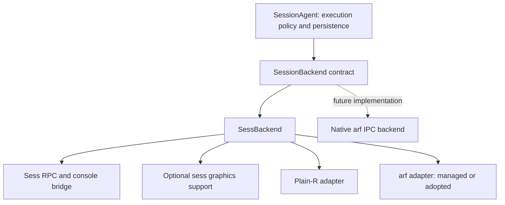

# Plan for the Interactive backend boundary

Prepared against `57ddfc0` for [the first point in the PR review](https://github.com/REditorSupport/vscode-R/pull/1805#pullrequestreview-5392223174). The implementation now follows this plan. Locations below describe the pre-refactor baseline; the current boundary is in `backend.ts`, `backendRegistry.ts`, `agentMain.ts`, and `backends/`.

Introduce a small internal `SessionBackend` contract and move the current R integration behind it. Keep one shared sess implementation, composed with either a plain-R or an arf adapter. This addresses the review within #1805 while leaving changes to arf's IPC protocol for a subsequent implementation. A public plugin API, a new execution engine, and new minimum R/VS Code versions are outside this refactor.

The current coupling extends beyond execution:

| Current location | Responsibility to move |
| --- | --- |
| `src/interactive/agent.ts:371`–`511` | sess RPC attachment, request correlation, native console framing, readiness and event decoding |
| `src/interactive/agent.ts:602`–`705` | provider branches in dispatch, process launch, arf readiness parsing, visible evaluation and bootstrap R code |
| `src/interactive/agent.ts:707`–`793` | JGD setup, font-metrics R process, plot attribution, batching and resize transport |
| `src/interactive/agent.ts:803`–`837` | signals, process liveness and owned-process cleanup |
| `src/interactive/manager.ts:518`–`558`, `1323`–`1355` | provider preflight and unconditional sess installation during creation and restart |
| `src/interactive/launcher.ts:88`–`142` | one cache/install operation currently bundles the agent, sess, bootstrap scripts and graphics resources |

Plain R currently calls `interactive_execute` over sess RPC. The arf path uses visible arf `evaluate` to call `sess::interactive_execute()`. Both still depend on the sess console bridge and use sess for inspection. Implementing two independent backends by copying that shared code would make subsequent fixes harder to maintain.

## Responsibility boundary



| Component | Owns |
| --- | --- |
| `SessionAgent` | Editor authentication, control leases, submission validation, queue/admission, execution IDs and durable states, deduplication, replay, cached workspace policy, output limits, asset storage and retention, editor fan-out |
| `SessionBackend` implementation | R readiness and metadata, transport connections and their authentication, RPC correlation/timeouts, execution dispatch, decoded runtime events, inspection, input delivery, runtime-originated editor requests, interruption and R-process lifecycle |
| Shared sess bridge | sess JSON-RPC, native console framing/UTF-8 decoding, sess bootstrap, mapping native messages into backend events; no journal, editor sockets or control leases |
| Plain-R / arf adapters | Executable invocation or adoption, startup banners, provider policy, dispatch transport, liveness and shutdown mechanics. arf HTTP details and R expression construction stay here or in sess-private helpers |
| Sess graphics support | JGD wire messages, metrics worker, graphics capability probe, frame attribution/coalescing, SVG production and resize transport. Emits display payloads; the agent stores assets and journals their references |
| Runtime preparation | Backend-specific prerequisites, compatible runtime installation/cache and prepared configuration. Node resolution and supervision of the independent agent remain common infrastructure |

Backend identity, frontend and process ownership must be distinct. Normalize today's selections internally as `sess + plain R + managed`, `sess + arf + managed`, and `sess + arf + adopted`. Keep the existing **R**/**arf** picker and public provider values for compatibility. A later native arf backend can serve the same arf selection without inheriting the sess implementation.

## Internal contract

The following is the intended surface, not a public extension API. Supporting types belong in a Node-only module and describe application operations rather than raw JSON-RPC packets.

```ts
interface SessionBackend {
    readonly ownership: 'managed' | 'adopted';
    readonly capabilities: BackendCapabilities;
    onEvent(listener: (event: BackendEvent) => void): () => void;
    start(): Promise<void>;
    dispatch(submission: Submission): Promise<void>;
    inspect(request: InspectionRequest): Promise<InspectionResult>;
    replyInput(reply: InputReply): Promise<void>;
    replyClientRequest(id: BackendRequestId, reply: ClientReply): Promise<void>;
    interrupt(): Promise<void>;
    stop(options?: { force?: boolean }): Promise<void>;
    resizePlot?(request: ResizePlotRequest): Promise<void>;
    dispose(): Promise<void>;
}
```

Use a discriminated `BackendEvent` union covering readiness/metadata, started/finished execution, decoded streams, conditions, input, displays, workspace invalidation, runtime-originated editor requests and their expiry, external-terminal output, warnings, transport unavailability and confirmed process exit. Carry execution IDs explicitly; unassociated terminal output must remain identifiable as such. Do not pass `net.Socket`, `ChildProcess`, `JgdMessage`, sess method names for execution, or arf HTTP response objects across this boundary.

`InspectionRequest` covers the existing workspace, child-object, hover/completion and data-viewer operations. Translate the existing agent wire methods into that typed union. The backend translates it into its own protocol. Likewise, runtime-originated editor requests carry an opaque backend request ID: the agent retains public reply/replay bookkeeping, while the backend owns the original RPC ID, connection and timeout. Preserve the current rule that expired requests are not replayed as actionable prompts.

The event subscription must be installed before `start()`. Startup launches/connects the runtime; a separate ready event establishes that execution is usable and reports the actual R path, version and library paths. Preserve startup failure diagnostics and bound partial-start cleanup. Snapshot/state updates must propagate negotiated metadata/capabilities to connected editors, not just update the manifest file.

`dispatch()` settles the transport operation, not the R evaluation outcome. Events may arrive before its promise settles. `started`/`finished` events remain authoritative, and a late transport response must not finish a cell twice. The agent records admission and its current execution before calling the backend. Preserve conservative `unknown` handling for ambiguous failures and never retry submitted code automatically. Distinguish transport loss from confirmed R-process exit; do not assume that losing an adopted session's IPC connection proves that R died.

Interruption must remain available for a slow inspection even after the request timed out and there is no submitted cell in `current`. Input IDs, generation checks and controlling-editor authorization remain enforced by the agent; the backend handles delivery and transport-specific limits.

## Lifecycle and graphics rules

| Action | Required behavior |
| --- | --- |
| Editor disconnect or closing the Interactive view | Release that editor connection; keep the independent agent and R running |
| Explicit Stop | Agent authorizes it, cancels queued work and calls backend stop; adopted R may be terminated because Stop explicitly authorizes that action. Report completion only after the exit outcome is established |
| Agent teardown after failure/shutdown | Force-stop an owned runtime when necessary, then dispose connections/helpers. Dispose an adopted connection without killing its R process |
| Restart | Prepare and validate the replacement before stopping the old process. Retain current generation/history rules. Adopted arf remains non-restartable from this command |
| Backend disposal | Idempotent, bounded cleanup; reject pending calls and suppress late callbacks. Restore adopted sess hooks where possible without interrupting or killing the user process merely to clean up |

Keep process signals and liveness checks in adapters. Do not expose `kill(pid, signal)` through the generic contract. Preserve arf's advertised IPC policy and visible evaluation; do not introduce a silent-evaluation fallback.

The graphics helper should flush already-buffered frames for a cell before emitting its completion, retaining the existing handling of later asynchronous plot updates. Preserve execution attribution, historical resize, multi-page output, byte bounds and coalescing. Static graphics remains available without JGD. The backend emits a standard display payload with a stable display/plot identity; the agent alone chooses asset IDs, applies storage quotas and journals retained output. A native backend that supplies SVG/PNG directly can omit JGD and metrics entirely.

Agent capabilities such as history, persistence, rename and queued cancellation stay agent-owned. Runtime capabilities such as input, debugger prompts, supported inspection, tables/HTML and live plot resizing come from the backend. Lifecycle capabilities describe ownership/restartability. Use these for operational checks; keep provider names for presentation. Supply compatibility defaults for existing manifests that lack newly introduced capability fields.

## Incremental implementation

1. **Define the contract and characterize agent policy.** Add `src/interactive/backend.ts` and a constructor/factory injection seam. Add a scripted fake backend to test admission, control leases, duplicate submissions, event ordering, transport ambiguity, input and shutdown without R or arf. Document today's observable lifecycle behavior before moving it; flag any required behavior correction separately from mechanical extraction.

2. **Extract the shared sess implementation and its frontend adapters.** Add `backends/sessBackend.ts`, `backends/sessBridge.ts`, `backends/plainR.ts` and `backends/arf.ts`, keeping `arf.ts` HTTP/discovery helpers reusable. Move socket/bootstrap/request handling and launch/adopt/interrupt/stop behavior out of `SessionAgent`. Normalize terminal-origin output without inventing source or execution boundaries. Replace direct dispatch/inspection/input/reply calls with the contract. Keep all three current launch modes working in this commit, with the same R bridge and no arf protocol change.

3. **Complete event, graphics and capability separation.** Move JGD and metrics-process handling into `backends/sessGraphics.ts`; keep assets/retention in the agent. Remove remaining provider branches from agent behavior and runtime-specific hardcoded capabilities. Verify that the agent's imports no longer reference arf, sess, graphics wire types or R-process launch helpers. Adjust editor capability refresh and lifecycle checks with legacy-manifest fallback. Run plot, input and runtime-request regressions at this cutover.

4. **Move preparation behind backend selection.** Introduce a fixed internal backend-definition table with `resolve/preflight`, `prepare` and runtime-factory entry points; no dynamic plugin loading. Split `installRuntime()` into common agent-bundle preparation and sess-specific runtime preparation. Creation and restart ask the selected definition for a prepared backend instead of always installing sess. Keep supervisor/Node validation, private-library isolation, cache locking/content hashes and compiler-free fallback behavior. A future backend must be able to return a prepared configuration without a sess library or sess bootstrap scripts. Update both creation and restart paths before considering the boundary complete.

5. **Validate compatibility and remove transitional wiring.** Read legacy flat `AgentConfig` values through one normalization function. If an optional prepared `backend` descriptor is persisted, current sess configurations retain derived legacy fields for older extension readers; do not keep two independently editable configurations. Reject unknown backend kinds rather than silently falling back. Keep `AGENT_PROTOCOL = 1`, existing journal/transcript formats, submission IDs and public provider values. Running agents continue using their original bundle; reconnection must not replace their backend or install packages. Test a replacement generation separately. Finish documentation and the full regression matrix, then build `/tmp/vscode-r-interactive.vsix` before any push.

The normalized prepared configuration should separate common agent settings from a discriminated backend descriptor. Today's required `rPath`, `library` and `resources` fields belong to the sess descriptor where needed; future backends must not supply dummy values to satisfy the common configuration type. Retain the derived flat projection only for current sess configurations and legacy readers.

The proposed files are ownership boundaries, not a requirement to create a deep class hierarchy. Favor composition. Run relevant tests in each implementation commit; the final step consolidates compatibility evidence rather than postponing testing.

## Validation and completion criteria

Add meaningful contract tests for both orderings of dispatch acknowledgement and execution completion; lost replies followed by late completion; duplicate and stale-generation events; partial startup failure; expired frontend requests; disposal during pending calls; and transport loss while work is running. None may automatically evaluate a submitted expression twice or write into a closed journal.

Run the current runtime/library suites for plain R, headless arf and adopted arf, with standard graphics and optional JGD. Retain profile/renv library-order tests, interruption after inspection timeout, input/browser prompts, observer leases, replay/live ordering, output bounds, all plot pages, historical resize, asset quotas and standalone-agent survival. Extend the adopted-arf test: currently its finalizer calls `child.kill()` after `adopted.close()`, so it does not demonstrate that disposal leaves the original frontend usable. Explicitly verify that its PID and existing objects survive disposal and that the original terminal can still evaluate code. Test explicit Stop separately.

Use a fake backend with no sess dependency for an agent-plus-preparation integration test. It must start, execute, emit output, answer an inspection and stop without invoking the sess installer, importing sess transports, or constructing R bootstrap code. It is a test implementation only; do not ship a speculative native arf backend to prove extensibility.

Run the Interactive editor/session tests for reconnect, input ownership, restart and retained history; supervisor tests remain independent of backend selection. Keep Node-only modules free of `vscode` imports and check the packaged agent bundle. Validate legacy saved configs and manifests as well as newly prepared ones. Compare execution/transcript semantics rather than byte-identical logs containing timestamps or random IDs.

The work is complete when adding a future native arf implementation requires changes to its backend/definition and tests, while agent admission, persistence, replay and editor execution routing remain unchanged. No unconditional sess installation or required sess-only configuration may remain in the common preparation path. Optional capabilities may change UI availability through the existing capability mechanism, not through new provider-name conditionals.

Keep compatibility policy separate from this extraction: do not raise R, Node or VS Code floors, require arf/JGD/Quarto, or claim that an interface removes native-build/OS requirements. Use the existing supported test matrix and explicitly record older R combinations that remain unverified. Broader dependency-version and offline-install improvements can follow without blocking a useful internal boundary.

## Implementation notes

The Node-only `SessionAgent` requires an injected backend factory. `agentMain.ts` is the shipped composition point. The fixed registry normalizes legacy configuration, validates backend-specific options, prepares the selected runtime, and constructs it. Common agent settings do not require an R path or sess library. The immutable agent bundle cache is independent of the sess cache; backend preparation keeps the existing private library, locking and binary fallback.

`sessBridge.ts`, `sessGraphics.ts`, `plainR.ts` and `arf.ts` compose the shared sess backend. `process.ts` centralizes process ownership and confirmed-exit handling. Disposal aborts pending arf HTTP requests without retrying evaluation. Adopted disposal requests restoration through sess's existing control transport and leaves R running; Stop waits for startup when necessary before ending the process. Exit remains authoritative if transport-close callbacks arrive later.

Additional editor fixes prevent retained native input/notebook models from supplying another session's initial drafts and prevent saved URI associations from reusing a window owned by a different session. Notebook execution and interruption callbacks report failures through the same error handler as source commands, including when a local control lease is stale.

Regression coverage includes a backend with no sess configuration, both dispatch/completion orderings, late or duplicate events, transport ambiguity, observer and generation checks, input identity, request expiry, startup failure, pending HTTP disposal, early Stop, and adopted-terminal usability after disposal. Existing runtime, library, graphics, editor, replay and supervision suites remain part of validation.
