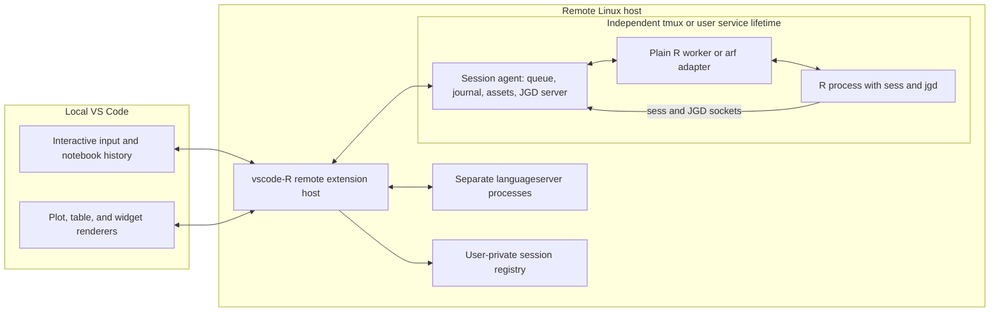

# R Interactive: persistent sessions and rich execution in vscode-R

> Implementation note (2026-09-30): See [the implemented workflow and validation guide](r-interactive.md) and `src/interactive/`. The runtime uses a registered native `sess` console bridge for both ordinary R and arf; streaming and console input do not require an upstream arf streaming extension. Recorded JGD group markers carry execution ownership across graphics replay. This design document retains its original exploration below; the implementation guide describes the shipped scope, platform limits, retention, and export behavior.


Technical implementation plan · 2026-09-30 · repository baseline `4f62343`

## 1. Recommendation

Build R Interactive as a notebook-backed client of persistent R sessions. Use VS Code's documented `interactive.open` command for the input-and-history interface, stable Notebook APIs for execution and output, and a remote **session agent** for process control, output retention, and reconnecting clients.

The session agent is a small service, separate from the VS Code extension host. Run one agent per R session. It owns the execution queue, `sess` connection, JGD endpoint, and durable transcript. A registry lets the extension discover agents. On Remote SSH, all these services and the R processes run on the Linux host; only the editor and output renderers run locally.

Support three session providers behind one contract:

1. **Managed plain R worker:** a standard R installation plus a worker driver and `sess`. This supplies a baseline without requiring `arf`.
2. **Managed headless arf:** use arf's embedded R frontend and IPC; add or negotiate the streaming and execution lifecycle capabilities missing from its current documented API.
3. **Existing arf in tmux:** discover and adopt the existing process through arf IPC, preserving its R memory and terminal. Support the capabilities the installed arf version actually offers, with a clear path to full integration.

Use `sess` for R/editor integration, object inspection, data views, and rich display hooks. Keep `languageserver` in separate R processes for responsive static language features. Use JGD for base/grid graphics and dedicated notebook renderers for tables and HTML widgets.

The central invariant is:

> Closing an Interactive window, reloading VS Code, losing SSH, or terminating VS Code disconnects a client. It does not stop R, discard accepted work, or close its plot device.

Do not require Jupyter, IRkernel, or an `.ipynb` file for the interactive workflow. Notebook APIs provide the UI building blocks; the session protocol is independent of Jupyter.

## 2. User experience and persistence contract

### The target workflow

For the existing workflow:

1. Start tmux on the remote server and run `arf --with-ipc` in several windows. In an already running arf, `:ipc start` enables discovery without restarting R.
2. In a Remote SSH window, run **R: Connect Interactive to Session**. List managed sessions and discoverable arf sessions, including label, project directory, R version, PID, start time, backend, activity, and tmux location when known.
3. Select a process. Create or reconnect its session agent, install the editor hooks in that process when it is ready, and open its Interactive window. Adoption must not replace the R process or its `.GlobalEnv`.
4. Send selections, lines, source files, or R Markdown chunks to that session; type into its Interactive input. Each execution has code, source navigation, timings, output, and an execution number.
5. Switch sessions through the session tree, Quick Pick, or existing Interactive tabs. Each tab remains associated with its original session and history.
6. Close VS Code. R, accepted jobs, output capture, and plotting continue on the host.
7. Reopen Remote SSH. Rediscover sessions, restore bindings, and replay missed output without running the code again.

Terminal and Interactive use can coexist when the provider can arbitrate access. On current arf, typing at the terminal or a busy R process can reject IPC requests; the UI must show that condition. Fully synchronized terminal-origin execution history requires additional arf events, not just its command-history database.

For a new session, **R: New Persistent Interactive Session** selects an R installation, provider, project directory, and name. Default new managed sessions to persistence; make stopping a process an explicit **Stop Session** action. **Restart Session** creates a new runtime generation and visibly separates old results from the new environment.

### What persists

| Situation | Required behavior |
|---|---|
| Close an Interactive tab | Session continues; reopening restores its history. |
| Reload/terminate VS Code or lose SSH | R and its agent continue; accepted executions finish and results are recorded. |
| Reconnect from another VS Code window | Discover the same session; acquire control or attach as an observer. |
| Switch to another R session | Queued/running work and output stay with the original session. |
| R process exits or crashes | Mark it exited; retained code, outputs, and exported assets remain readable. |
| Agent crashes | Treat separately from editor disconnection; reconcile state conservatively and never replay uncertain code automatically. |
| Host reboot, tmux server death, or job scheduler termination | Live R memory is lost unless an external runtime preserves it. Retained artifacts can remain. |

Persistent process state and persistent artifacts are separate guarantees. `.RData` is an optional explicit checkpoint, not a substitute for a live process: external pointers, database connections, native state, and background services cannot generally be restored faithfully. History also cannot reconstruct an arbitrary environment safely.

## 3. What exists today and what is missing

The following findings are from this checkout, rather than assumptions about older vscode-R releases.

| Existing component | Reuse | Required change |
|---|---|---|
| [`src/session.ts`](../src/session.ts) | Session map, process-lifetime `session_id`, socket replacement checks, discovery, workspace requests | Separate session identity from connection lifetime; introduce explicit session-targeted requests and retained disconnected records. |
| [`sess/R/server.R`](../sess/R/server.R) | Local JSON-RPC over JSON Lines, `attach`, reconnect generation checks | Connect persistent sessions to the agent. Current dispatch has inspection/view methods, but no execution kernel contract. |
| [`sess/README.md`](../sess/README.md) | Documented protocol and managed-terminal discovery | Existing discovery is refreshed for VS Code terminals; it is not a host-wide persistent session registry. |
| [`src/rTerminal.ts`](../src/rTerminal.ts) | Selection/chunk commands, console configuration and R path resolution | Execution currently calls `Terminal.sendText`; introduce a common execution-target router. |
| [`src/completions.ts`](../src/completions.ts) | Live object completions and hover | Replace global active-session lookups with document/session bindings and bounded, cancellable queries. |
| [`src/languageService.ts`](../src/languageService.ts) | Separate `languageserver` processes and notebook-cell support | Add Interactive input documents, project/environment resolution, and correct URI/session routing. |
| [`src/plotViewer/jgdSocketServer.ts`](../src/plotViewer/jgdSocketServer.ts), [`jgdPlotHistory.ts`](../src/plotViewer/jgdPlotHistory.ts) | JGD framing, incremental frames, plot history and resize routing | Move persistent endpoints/history into the agent; distinguish R session identity from JGD device identity. |
| [`src/plotViewer/jgdViewer.ts`](../src/plotViewer/jgdViewer.ts) | Canvas rendering, font metrics, export UI | Extract reusable renderer code; add headless metrics and durable plot assets. |
| [`src/dataViewer.ts`](../src/dataViewer.ts), [`sess/R/handlers.R`](../sess/R/handlers.R) | Paged/filterable/sortable tables and object inspection | Make handles session-specific and add compact inline notebook representations. |
| [`src/webViewer/index.ts`](../src/webViewer/index.ts) | Existing HTML viewer behavior | Introduce isolated widget outputs and durable dependency bundles. |

Important current limitations:

- `sessionRequest()` selects the global `pipeClient` and uses a five-second timeout. A table panel created for session A can subsequently issue a request through the active session B. Target identity must travel with every panel and request.
- Socket cleanup removes a session from the map. That represents connection state, not proof that the R process exited.
- `sess` polls with `later`. This does not provide an independently responsive execution/control thread during arbitrary R computation.
- Disconnect calls `runtime_stop()`, restoring hooks and closing tracked devices. Managed reconnect helps, but it does not provide durable plot history.
- JGD socket IDs in this extension are local connection counters, not `sess` process identities.
- The JGD viewer supplies font measurements through a webview. A persistent plotting service needs to handle this with no VS Code window open.

## 4. VS Code API strategy

### Use the existing Interactive Window API

The public [command reference](https://code.visualstudio.com/api/references/commands) documents `interactive.open`. The inspected implementation accepts show options, a resource, a controller ID, and a title, and returns notebook/input URIs plus an optional notebook editor [V1, V2].

Conceptually:

```ts
const result = await vscode.commands.executeCommand<{
    notebookUri: vscode.Uri;
    inputUri: vscode.Uri;
    notebookEditor?: vscode.NotebookEditor;
}>(
    'interactive.open',
    { viewColumn: vscode.ViewColumn.Beside, preserveFocus: true },
    previousInteractiveUri,
    qualifiedControllerId,
    `R: ${session.label}`,
);
```

Keep this command and its result validation in one compatibility adapter. Verify the qualified controller-ID format against the target VS Code release. Use the returned URIs; the inspected implementation can allocate a new `Interactive-N.interactive` resource when it is not reopening an existing editor. That URI must never become the durable session ID.

Register `NotebookController`s for notebook type `interactive`, with R as the supported language. Associate controllers with session identities; scope controller IDs by provider/host/session to avoid collisions. Set `supportsExecutionOrder`, implement `executeHandler`, and use `interruptHandler` consistently with execution cancellation.

For code submitted from an R file, append a code cell with `WorkspaceEdit`/`NotebookEdit`, preserving the exact source text and origin metadata, then dispatch once through the same execution coordinator used by input-box execution. Do not execute once through a command and again through the controller callback.

Drive outputs with `NotebookCellExecution.start`, `appendOutput`, `appendOutputItems`, `replaceOutputItems`, and `end`. Implement custom output renderers through `contributes.notebookRenderer` and `notebooks.createRendererMessaging`. Completed output snapshots belong in notebook data; renderer messages are for live updates and requests, not the only copy of a result.

### Keep proposed APIs out of the required path

`NotebookDocumentShowOptions.asRepl` and `NotebookEditor.replOptions.appendIndex` are still in `vscode.proposed.notebookReplDocument.d.ts` in the inspected upstream source [V3]. They are attractive for a future custom notebook type, but a normal Marketplace release must not assume proposed-API access. The similarly named `vscode.proposed.interactive.d.ts` currently concerns chat transfer, not a typed R Interactive creation API.

Use public `interactive.open` plus stable Notebook APIs first. Provide a standard `r-interactive` notebook/serializer as a fallback and export surface if a supported VS Code version cannot provide the required Interactive behavior. Do not take ownership of or override the shared built-in `interactive` serializer.

The first spike must test a packaged extension on the minimum supported VS Code version and current stable, with Jupyter absent and present. The repository declares `engines.vscode: ^1.110.0`, while its declared `@types/vscode` range starts at 1.75; align the development API baseline deliberately. Upstream-main inspection is evidence of current implementation, not certification of the minimum version.

### Restoring running executions

VS Code execution objects do not survive extension-host reload. Recreate the notebook projection from the agent's journal, bind restored cell IDs to live execution IDs, and resume displaying output. Probe whether a restored controller can represent the running cell directly with stable APIs. If necessary, use a restored cell plus explicit running status until the terminal event arrives. Do not invent execution completion or rerun the cell to recreate UI state.

For updates after a cell has completed, such as `abline()` changing an older plot, use the current execution's supported cross-cell output update when appropriate, or a live renderer update backed by an authoritative persisted snapshot. Validate how snapshots are restored with stable APIs; do not retain and reuse an ended execution object.

## 5. Runtime architecture and lifecycle



Instantiate the persistent group once per session. Registry discovery can initially use files; a permanently running global broker is unnecessary. This limits failure scope and avoids coupling unrelated R sessions to one broker process.

### Deployment and supervision

- **Linux first:** use a tmux provider by default for the initial implementation because it matches this use case. Each managed agent runs in its own window of a dedicated persistent tmux session. It launches its R worker with pipes it continues draining while no editor is attached.
- An adopted arf stays in its existing tmux window. Its agent connects to the existing IPC endpoint; record `managed` versus `adopted` ownership. Terminating an adopted process requires the explicit stop command and appropriate confirmation in the product.
- Offer a user-service provider for installations that prefer systemd. Account for user-manager/logout policies; persistent service configuration may require administrator support. Neither `detached: true` nor `unref()` alone proves survival of a remote-server shutdown, logout, or cgroup cleanup.
- Start with a standalone TypeScript agent to reuse protocol and plot code. Make its runtime explicit: a supported server-side Node runtime for development, then a versioned packaged runtime/CLI or a documented runtime prerequisite for distribution. Do not depend on the extension host executable or a VS Code installation directory remaining available.
- Copy/version agent code and the required R runtime helpers into user storage before launch. An extension upgrade must not delete code that a live session still needs. New agents use the new version; existing agents negotiate compatibility until explicitly restarted.
- Always drain worker output, even with zero clients. Use bounded memory, disk spooling, and backpressure handling. Never let a slow notebook renderer fill the R process's stdout pipe.

Give `sess` agent-owned discovery separate from VS Code terminal discovery. Today its reconnect loop waits for a *different endpoint string*. For agent replacement, either publish a new endpoint atomically or extend discovery with an optional agent-instance identifier and retry a reused endpoint safely. Keep agent incarnation separate from R generation: replacing an agent must not imply that the R process restarted. A frontend detach never closes the agent's `sess` transport; an actual agent failure follows a separately tested recovery path and may require reinstalling hooks/devices.

Suggested layout, configurable for cluster environments:

```text
~/.local/state/vscode-r/
  runtimes/<agent-version>/
  sessions/<session-id>/
    manifest.json
    events-000001.jsonl
    execution-index.json
    snapshots/
    assets/<content-hash>/...

<private-runtime-dir>/vscode-r/<session-id>/
  control.sock
  sess.sock
  jgd.sock
```

Use atomic manifest replacement, private directories, and bounded socket path lengths. Prefer reliable host-local storage for active journals; account for network home-directory semantics and runtime directories cleaned at logout. Record host identity to prevent a shared home directory from mixing sessions from different servers. Live PID/start-time verification must accompany discovery; a stale manifest or a PID alone is insufficient.

### Session identity and frontend bindings

Model the following separately:

```ts
interface SessionRef {
    hostId: string;
    sessionId: string;       // durable named session slot
    generation: string;      // new for each R-process incarnation
}

interface SessionRecord {
    ref: SessionRef;
    runtimeSessionId: string; // sess process-lifetime identity
    provider: 'r-worker' | 'arf-headless' | 'arf-existing';
    ownership: 'managed' | 'adopted';
    lifecycle: 'starting' | 'alive' | 'exited' | 'unknown';
    activity: 'idle' | 'busy' | 'awaiting-input' | 'debugging';
    endpoint: string;
    capabilities: Record<string, boolean | string>;
    lastEventSeq: number;
}
```

Frontend connection state (`connected`, `reconnecting`, `disconnected`) is independent of process lifecycle/activity. Use the agent to distinguish R busy from an unavailable frontend. Detect arf restart using its startup-generation metadata as well as process identity; its endpoint and PID can be reused [A1].

Default to one Interactive transcript per session generation. Switching sessions focuses that transcript rather than mixing results from unrelated environments into one notebook. A restarted session may remain in the same tab with an explicit generation boundary, while preserving the old transcript as read-only history.

Maintain `notebookUri -> SessionRef`, `inputUri -> SessionRef`, and optional source-document bindings. Source execution resolves the target once at submission. The source URI, document version, exact code, code hash, line/range information, and target generation travel with the request. Cursor movement or switching tabs cannot retarget an accepted request.

Workspace, plot, table, help, completion, restart, and `rstudioapi` actions all use an explicit session context. Active session becomes a UI default, not a transport-routing mechanism.

## 6. Execution, events, and recovery protocol

### Keep three protocols distinct

1. **Editor ↔ agent:** new versioned control and event protocol over local sockets on the remote host.
2. **Agent ↔ R editor hooks:** existing `sess` JSON-RPC/JSON Lines with negotiated additions.
3. **Agent ↔ arf:** arf's HTTP JSON-RPC over a Unix socket/named pipe [A1]. It is not the same framing as `sess`.

Preserve legacy `sess` protocol version 1 for existing terminal clients. Negotiate optional capabilities for additive changes; version incompatible contracts explicitly. All protocol and R helper names proposed below are new design interfaces, not existing `sess` or arf APIs.

### Control requests

| Request | Semantics |
|---|---|
| `session/describe`, `session/attach` | Identity, generation, capabilities, status, and control lease. |
| `execution/submit` | Durably accept a unique execution ID and immutable code before replying. |
| `execution/query` | Reconcile queued/running/completed/unknown state by ID. |
| `execution/cancelQueued` | Remove a request that has not started. |
| `execution/interrupt` | Interrupt the specified running execution; return request acknowledgement separately from actual interruption. |
| `input/reply` | Reply to a particular input request and execution. |
| `events/subscribe(afterSeq)` | Replay missed events, then stream new ones. |
| `view/request` | Session-scoped paging, object inspection, plot resize, or asset retrieval. |
| `session/detach`, `session/stop`, `session/restart` | Explicitly different operations. |

Use one serialized user-code queue per R process and parallel execution across independent processes. Low-priority inspection requests must not run recursively during user evaluation. Purge cancelled/stale hovers and coalesce workspace refreshes.

Each event has an envelope:

```ts
interface SessionEvent {
    protocolVersion: number;
    session: SessionRef;
    seq: number;             // monotonically increasing in the journal
    executionId?: string;    // absent for genuinely asynchronous output
    producerSeq?: number;    // orders events from an individual producer
    type: string;
    timestamp: string;
    payload: unknown;
}
```

Core events: `executionAccepted`, `executionStarted`, `stream`, `condition`, `display`, `displayUpdated`, `inputRequested`, `executionFinished`, `workspaceChanged`, `sessionStateChanged`, and `outputTruncated`.

An execution finishing includes success/error/interrupted/unknown status, timings, structured conditions and traceback where available, and the resulting workspace revision. Stream text uses a UTF-8 streaming decoder, supports carriage-return progress output, and retains producer/channel information. Large assets use references, chunking, and checksums rather than unbounded JSON messages.

### Ordering and deduplication

- Generate execution IDs before submission. Persist acceptance and the deduplication record before starting R; the worker also rejects duplicate IDs within its generation.
- On reconnect, query an uncertain submission by ID. Do not treat a dropped response as proof that evaluation did not start.
- Journal events before delivery; replay by sequence and deduplicate in the notebook projection. Keep execution IDs separate from notebook cell indices, which change when history is paged or cleared.
- Define disk durability explicitly: fsync accepted submissions before acknowledging them, batch ordinary output writes, and flush execution-completion records before advertising durable completion. Editor crashes must lose no agent-retained output; power-loss guarantees are limited by the configured flush policy. Handle disk-full failure without blocking R indefinitely or silently claiming persistence.
- Do not claim exactly-once R side effects across process crashes. If an agent/worker dies after a side effect but before completion is durably recorded, label the execution **outcome unknown** and require a deliberate rerun.
- Carry execution context through `sess` display hooks. JGD and console events arriving on separate sockets need explicit producer ordering and an execution-end flush/barrier, or negotiated execution tags, before advancing the queue. Arrival time alone cannot reliably assign a late plot frame to a cell.
- For external terminal commands, obtain begin/end/context events from the provider. When unavailable, record uncorrelated output as session activity rather than assigning it to the last Interactive cell.
- Bound memory and disk usage. Preserve command/status records; spill large streams/assets and record truncation or eviction explicitly. Pin assets referenced by retained notebook outputs. Clearing UI history, deleting retained history, and stopping R are distinct actions.

### Reconnection algorithm

1. Read matching registry entries and connect with bounded exponential backoff and jitter.
2. Validate ownership, protocol, host/session identity, generation, and capabilities.
3. Fetch a snapshot at a stated event sequence and subscribe after that sequence atomically, preventing a replay/live-event gap.
4. Reconcile locally pending execution IDs with the agent ledger.
5. Restore a bounded recent history window, then replay missing events and resume live delivery.
6. Rebind live table/plot handles and refresh expired frontend asset URLs.
7. Restore the editor's selected session without automatically executing code.

If the requested event range was compacted, return an explicit reset/snapshot response. If R's generation changed, retain old results and invalidate old live handles. A five-second editor RPC timeout must never be used as an execution completion deadline.

### Multiple clients and prompts

Allow multiple observing clients and one execution-control lease initially. Lease loss does not cancel running or already accepted work. Transfer control explicitly; every mutation validates the lease and generation. arf must still arbitrate with its local terminal, which is not controlled by an editor lease.

Route synchronous `rstudioapi` requests and stdin prompts to the controlling client. With no client, either preserve an explicit `awaiting-input` state for resumable stdin, or return a bounded, typed “frontend unavailable” error for editor-only operations. Today `request_client()` can wait while the connection remains open; the agent must not leave such requests waiting forever merely because it keeps that connection alive. Password replies must not enter the transcript.

## 7. Session providers and R semantics

### Plain background R

Add a managed worker entry point, for example the proposed `sess::run_worker()`, launched by the session agent. The worker owns the evaluation loop and `.GlobalEnv`; `sess` continues to provide editor hooks.

Use a dedicated execution driver that receives structured submissions at safe points. Prototype R-level evaluation with `evaluate` and output handlers, or an equivalent carefully tested expression driver. This is a new dependency/implementation choice to settle in the execution spike. It must preserve visible-value printing, assignments, multiple expressions, warnings/messages, errors, source locations, working directory, options, and random-number state as expected for interactive use.

Do not simply add `eval(parse())` to the current `later` dispatch table and call it a kernel. Inspectors can themselves force promises, active bindings, or methods; schedule them deliberately, never as arbitrary reentrant calls during user evaluation.

The agent drains stdout/stderr separately so native console writes cannot block behind the notebook. Structured output handlers identify R conditions and rich displays. Test direct native writes and subprocess output separately: there is no total ordering across independent OS stdout/stderr pipes without capture-layer support. Where attribution is uncertain, retain a session-level stream.

A plain Rscript-style worker is not a complete console frontend. `interactive()`, `readline()`, `scan()`, `menu()`, `browser()`, and debugger behavior differ. A pure-R MVP should advertise stdin/debugging as unsupported and fail clearly rather than silently returning incorrect input or hanging. Full parity requires a native R frontend/console callback layer or a provider such as arf with the required callbacks exposed. Keep this as an explicit full-product milestone.

On Linux, the agent can send a targeted SIGINT without waiting for the R RPC loop. Catch interruption at the managed worker's evaluation boundary, restore capture state, emit an interrupted completion, and return to the command loop; the default behavior of an unguarded Rscript process is insufficient. Validate actual interrupt behavior across computation, sleep, native code, input, and child processes. Never send it to the tmux server or an unverified/reused PID. Non-interruptible native calls remain a limitation; force termination is a separate explicit action.

### Managed arf and existing tmux arf

Current arf already provides useful primitives [A1]:

- `arf headless --json` supplies a readiness record and endpoint.
- `arf --with-ipc`, `:ipc start`, and `arf ipc list` support existing terminal sessions.
- `session` reports process/runtime status; `history` works independently of R evaluation.
- `evaluate` returns captured `stdout`, `stderr`, `value`, and `error`; `user_input` submits visible input.
- Interactive mode rejects busy, incomplete-input, and user-is-typing conflicts. Headless mode queues work.

Use the wire API directly from the agent once discovery is established; avoid launching an arf CLI process for every editor keystroke or execution. Keep the agent's durable queue as the authoritative queue and dispatch at most one user execution at a time.

Two caveats affect the product design:

1. Current `evaluate` documents a completed response, not a replayable execution-event subscription. A timeout limits waiting and does not cancel R. An agent that remains connected can retain the eventual response, but cannot recover it after its own crash or provide arbitrary live streams from this API alone.
2. Silent evaluation has an allowlist policy; normal R assignments/control flow are restricted by default. Visible evaluation in an interactive arf requires terminal approval unless the user enables its process-local `:ipc send-policy allow`. Headless visible evaluation has different behavior. Query and respect `ipc_policy`; do not evade it by hiding evaluation inside an inspection request.

For the full provider, coordinate additive upstream arf capabilities:

- execution IDs, admission/start/completion events, live stdout/stderr, and structured condition events;
- subscription or durable/reconcilable execution status;
- interrupt and stdin/input callbacks with execution-scoped request IDs;
- begin/end events for terminal-origin commands and safe terminal/editor arbitration;
- execution context handed to `sess` rich-display hooks;
- an explicit trusted-editor connection policy that preserves arf's security model.

Native `WriteConsoleEx` integration is a strong reason to support arf, but its current buffered output API must not be described as a complete streaming notebook kernel.

Adoption begins retaining new rich output after hooks are connected. Existing arf history can populate code-only history with provenance, but it cannot recover past console output, discarded plots, or widgets that were never captured. Make that boundary visible while preserving all existing R objects.

| Capability | Plain worker initial implementation | Current documented arf IPC | Full provider target |
|---|---|---|---|
| Persistent R memory after VS Code exit | Agent/tmux supervision | Existing tmux or managed supervision | Yes |
| Run code and retain completed results | New driver | Available, subject to policy/mode | Yes |
| Structured live console output | New handlers; validate native writes | Not exposed as a documented event stream | Yes |
| Recover missed UI output | Agent journal | Agent can journal returned results | Yes |
| Recover after agent crash | Conservative reconciliation | In-flight result recovery not established | Defined, with unknown outcomes retained |
| Inline JGD/tables/widgets | New `sess` display integration | Requires the same `sess` integration | Yes |
| `readline()` and debugging parity | Native support needed | IPC input/debug contract not established | Capability-gated native integration |
| Reuse an already running terminal R | Separate adoption work | Supported through arf discovery/IPC | First-class tmux workflow |

Implement both providers against the same conformance suite. Deliver the plain worker baseline independently; ship current arf compatibility with accurate capability labels, then enable full arf behavior when its integration contract passes the same tests.

## 8. Rich output and plotting

### Display model

Introduce a `sess` display publisher with MIME bundles, display IDs, revisions, execution context, and asset references. Always include a useful plain-text fallback. Prefer class-specific display adapters over globally replacing every S3 print method, and prevent duplicate printing when an object has a rich representation.

| Content | Inline output | Expanded/live view |
|---|---|---|
| Text, messages, warnings, errors | Stream/error output items with source links | Full retained log/traceback |
| Base/grid/ggplot graphics | JGD frame renderer plus static fallback | Existing plot pane, history and export |
| Data frame/tibble/matrix | Bounded table preview with dimensions/types | Existing paged/sortable/filterable data viewer |
| htmlwidgets, including plotly/DT/leaflet | Isolated widget renderer and dependency bundle | Pop-out viewer |
| HTML tables, rich summaries, Markdown, JSON | Dedicated renderer or sanitized static representation | Existing viewers where appropriate |
| Shiny or other live applications | Status/launch card; inline embedding where feasible | Forwarded live app view |

HTML widgets and JGD solve different problems. JGD supplies responsive rendering of R graphics; plotly-style hover, selection, and browser-side behavior require the widget's JavaScript runtime. Shiny additionally requires a live server, often using a separate R process if the analysis session must remain free to execute code.

### JGD persistence and cell association

1. Move the JGD listener and retained frame state into the agent, using a stable endpoint for the agent's lifetime. `JGD_SOCKET` must identify this endpoint, not a per-window extension socket.
2. Scope device connections by `SessionRef + deviceId + deviceGeneration`. Map JGD's opaque device identity to the owning R session explicitly; its `sessionId` is not the `sess` process identity [J1]. A per-session listener simplifies that association.
3. Persist full frames and ordered deltas, periodically compacting them into full snapshots. Never retain only a delta whose base frame has been evicted.
4. Associate plots with execution/display IDs through the ordering contract in section 6. Support several plots in one execution, incremental additions, multiple devices, and plotting after an execution via asynchronous callbacks.
5. Preserve an immutable plot snapshot/revision for each completed execution. For `plot()` followed in a later cell by `abline()`, keep the first cell's original snapshot and attach the resulting revision to the second cell; the dedicated plot pane follows the live device. This makes historical output understandable and exportable.
6. Use cached operations for immediate client-side scaling. Debounce true R-device resize/replay and target the owning device only. Choose one canonical viewport owner per live device, so multiple tabs do not repeatedly resize each other's plots.
7. Provide a headless font-metrics service in the agent. Evaluate a maintained Canvas/Skia implementation with deterministic fonts and caching. Reuse those metrics while detached; account for fonts available remotely versus locally. Benchmark this dependency before packaging it. Zero-width fabricated responses are not an acceptable layout strategy.
8. Persist static SVG/PNG fallbacks and necessary fonts/resources where permitted. Retained plots must still display when R exits. Reflow requiring `recordPlot()` or device replay remains dependent on the live device; serialized recorded plots are not the durable cross-version artifact format.

The headless metrics/export path is a release gate for “plots continue while disconnected.” If it cannot be supplied on a platform initially, use a documented static graphics provider there rather than claiming full detached JGD support.

### Tables, HTML, and assets

- Reuse `dataview_init/page/dispose`, but key every handle and panel by session generation and view ID. A panel's disposal must not dispose a view in another session or another active subscriber.
- Distinguish immutable previews from live object handles. Show the snapshot's workspace revision. Use handles to the displayed object where possible rather than re-evaluating arbitrary name expressions on every page.
- While R is busy, show cached pages and queue explicit live queries; do not promise instant arbitrary sorting/filtering of an in-memory R object during computation. Optional Arrow/disk snapshots or a separate query worker can support heavier exploration with explicit memory/storage costs.
- Copy HTML and dependencies out of R `tempdir()` into the agent's asset store. Rewrite relative URLs, preserve dependency ordering, and content-deduplicate bundles. Keep htmlwidget dependencies separated per output to avoid JavaScript-library collisions.
- Notebook renderer messaging can carry lightweight requests and small assets. For larger bundles/live apps, use a loopback asset service with scoped access and VS Code remote URI forwarding. A local webview cannot access the remote machine's Unix socket or assume its own `localhost` is the remote server.
- Use isolated iframes, controlled resource roots, CSP, message validation, and Workspace Trust. HTML output must not gain unrestricted access to editor commands or the session socket. Ordinary user-requested plotting must remain a smooth flow within the established workspace trust model.
- Recreate forwarded URLs after reconnect; persist asset IDs and relative dependencies, not temporary URLs or access tokens. Offline export includes static fallbacks and self-contained assets where possible; live app connections are labeled as requiring the session.

## 9. Language features and responsiveness

Keep `languageserver` independent of the executing R process. Pool language servers by project, R installation, library paths, and relevant configuration; separate when environments differ. Opening ten session tabs should not automatically spawn ten identical language servers.

Add both `vscode-notebook-cell` and `vscode-interactive-input` documents to the language-service path. The current implementation filters out the latter. Resolve a virtual document's project directory through its binding, not `dirname('/Interactive-1.interactive')`. If the installed language server cannot handle an input URI scheme, use a synchronized virtual document and correct position/URI mapping.

Combine two sources:

- **Static:** parsing, diagnostics, symbols, references, signature information, and package knowledge from `languageserver`.
- **Runtime:** cached globals, object types, names, dimensions, and controlled live inspection from the target session through `sess`.

Cache runtime information by session generation and workspace revision. Update summaries at safe boundaries, debounce repeated notifications, and lazily expand expensive objects. Avoid full `str()` traversal of every large object after every cell.

Use short deadlines and cancellation for completion/hover, and retain useful cached/static results when R is busy. Reject stale replies if document version, cursor context, session generation, or selected target changed. Do not execute arbitrary hover expressions merely to make every tooltip richer; promises, active bindings, `$` methods, and remote data objects may be expensive or mutating.

## 10. Performance and reliability targets

These are proposed acceptance budgets to measure, not claims about current performance. Report hardware, number of sessions, output volume, and network RTT with results.

| Operation | Initial target |
|---|---|
| Typing/input interaction | p95 local UI work below 50 ms, independent of R activity |
| Submit acknowledgement | p95 below 100 ms on the remote host, plus transport latency |
| Produced text reaching output | Batch over 20–50 ms; p95 under 150 ms added overhead on a low-latency connection |
| Switch among cached sessions | p95 below 100 ms for visible local state; async live refresh |
| Cached/static completion | p95 below 150 ms; dynamic inspection deadline around 200 ms |
| Reconnect to live agent | Recent history and state visible within 2 seconds on a healthy host; load older assets lazily |
| Large outputs/history | Bounded extension memory, paged history, explicit stream/asset quotas |
| Concurrent sessions | Stress at least 10 sessions; busy sessions do not delay another session's control channel |

Use bounded output queues, batching, incremental plot frames, renderer virtualization, and lazy asset loading. Separate control messages from bulk output so cancellation/status is not starved. Instrument queue delay, execution time, output delay, serialization cost, metrics requests, replay lag, and storage growth. Long R computation remains long R computation; responsiveness means the editor and other sessions continue working.

## 11. Implementation work packages

Deliver in dependency order. Phase 0 resolves feasibility before a large refactor; the full feature should not be announced at the first successful inline plot.

| Phase | Work | Exit criteria |
|---|---|---|
| **0. Compatibility and semantics spikes** | Packaged Interactive controller, minimum/current VS Code; plain-worker output/input semantics; arf policy/IPC; detached JGD metrics; agent runtime packaging | Verify native input/history and custom output with no Jupyter dependency; publish provider capability results and packaging decisions. |
| **1. Explicit session routing** | `SessionRegistry`, `SessionClient`, document/view bindings, state model; retain legacy adapter | Two sessions can execute and display tables/plots without cross-routing, including a switch while requests are pending. |
| **2. Durable agent and plain worker** | Independent supervision, registry, journal/assets, queue, IDs, SIGINT, reconnect; `sess` worker/display contract | Remote run survives VS Code termination; reconnect restores memory and missed outputs with no duplicate evaluation. |
| **3. Interactive UI and productivity** | Session tree/picker, controllers, source/chunk routing, execution history, cached workspace, input LSP | Daily script-to-Interactive workflow works with several persistent sessions and responsive language features. |
| **4. Complete rich output** | Extract JGD renderer/server, headless metrics, snapshots, table renderer, widget bundling/forwarding, export | Plots/tables/widgets retain correct session/cell ownership, including creation while detached. |
| **5. Full arf/tmux integration** | Current-API compatibility adapter; upstream lifecycle/stream/input support; terminal event arbitration | Adopt existing arf without replacing R; terminal and Interactive actions share a correct, persistent transcript where advertised. |
| **6. Hardening and broader platforms** | Native input/debug support, multiple observers/control transfer, upgrades, quotas, Windows/macOS service providers | Provider conformance and failure matrix pass; persistence limitations are explicit and diagnosable. |

The arf and headless-graphics spikes should happen early even though full integration lands later. They determine upstream dependencies and prevent the UI implementation from promising capabilities the runtime cannot supply.

### Suggested code boundaries

```text
src/session/                 registry, clients, bindings, legacy adapter
src/interactive/             window adapter, controllers, execution coordinator
src/interactive/renderers/   JGD, table, HTML/widget output entry points
src/sessionProviders/        plain worker and arf provider descriptors
src/sessionAgent/            standalone agent, journal, assets, supervision
src/protocol/                shared schemas, framing, version/capability checks
sess/R/                     worker driver, execution context, display publication
```

Split `src/session.ts` gradually; preserve existing exported behavior through adapters while migrating callers. Update `src/extension.ts`, `src/rTerminal.ts`, `src/completions.ts`, `src/workspaceViewer.ts`, `src/languageService.ts`, `src/rstudioapi.ts`, and viewer request paths to use explicit contexts. Keep ordinary terminal execution available as a selectable target.

Add commands for new/connect/switch/detach/interrupt/stop/restart/restore/export. Introduce settings for provider, persistence, default execution target, reconnect policy, and retention. These names should be reviewed before stabilization. Preserve existing terminal command behavior unless the user selects Interactive as the target.

Extend `esbuild.js` with separate extension, browser renderer, and standalone agent entry points. Define explicit `extensionKind: ["workspace"]` behavior for the remote-side extension after compatibility review. Renderer code must not import Node or `vscode` APIs. Add compatible public session enumeration/event/execute APIs only after the internal model is stable.

## 12. Validation and release gates

### Required end-to-end scenario

On a remote Linux host, run at least three sessions: a managed plain R worker, a managed arf session, and an adopted arf in an existing tmux window. In each, create a unique variable and submit a long job that emits text and several plots. Disconnect and terminate VS Code during the job, then reconnect.

Verify process identities and variables remain unchanged; completed and running executions reconcile correctly; output produced during disconnection is retained; plots still have usable text layout; sessions remain isolated; and no code runs twice. Also verify terminal-only work continues in the adopted session. Gate any unsupported provider capability explicitly rather than counting a reduced test as a full pass.

### Automated coverage

- **Protocol:** fragmented frames, oversized payloads, UTF-8 split boundaries, request-ID collisions, stale socket closes, malformed messages, incompatible versions, partial journals, snapshot/replay boundaries, output eviction, and duplicate submissions.
- **Semantics:** visible/invisible results, several expressions, syntax errors/incomplete input, warnings/messages, `options(error=...)`, traceback/source references, `.Last.value`, task callbacks, native/subprocess writes, encoding, working-directory changes, and namespace/library changes.
- **Concurrency:** switch active session during a slow table request; close an old session socket after its replacement attaches; interrupt one session while another is busy; expire a control lease; interleave terminal and Interactive requests.
- **Lifecycle:** close tab, reload window, restart extension host, kill local VS Code, drop SSH, stop remote VS Code server, stop R, restart arf with a reused endpoint, kill the agent, fill the disk, and remove stale registry entries.
- **Graphics:** several plots per cell, several devices, incremental additions across cells, late frames, delayed font requests, no frontend, history compaction, resize after deleting plots, duplicate device IDs, and static replay after R exits.
- **Rich assets:** widget dependencies after R temp files disappear, remote URL regeneration, disconnected table handles, generation changes, content isolation, and export with no live R process.
- **Language services:** virtual input URI routing, two sessions with different library paths, stale completion responses, and useful completion while R is blocked in native code.

Extend the existing TypeScript session/JGD tests and `sess` tinytests. Add provider contract tests plus a Linux integration harness that actually controls tmux and independent processes. Use packaged-extension tests for VS Code behavior that mocks cannot establish. Include current stable and the supported minimum in CI; add higher-latency Remote SSH tests before release.

### First implementation slice

The smallest useful vertical slice is:

> Two plain R sessions under persistent agents, two native Interactive windows, explicit routing, streamed text, one retained plot per execution, and reconnect-after-VS-Code-exit without reevaluation.

Run the arf adoption and headless JGD experiments alongside the design of that slice. Expand to complete JGD, tables/widgets, and full arf integration only once lifecycle and execution correctness are established.

## 13. Main risks and decisions to resolve

| Risk | Decision or mitigation |
|---|---|
| Interactive API behavior differs across supported versions | Isolate the public command adapter; packaged compatibility tests; stable notebook fallback. |
| R-level worker differs from a true console | Semantic conformance tests, explicit capability limits, and native frontend support for full input/debugging. |
| arf IPC changes or lacks streaming/control | Pin tested compatibility ranges; probe capabilities; coordinate additive upstream support. |
| Agent lifetime accidentally follows VS Code | Independent tmux/user-service supervision and destructive lifecycle integration tests. |
| Headless JGD font metrics introduce a packaging dependency | Early metrics/export spike with deterministic fonts and static-provider fallback. |
| Multiple channels misattribute output | Execution tags/barriers and producer ordering; explicit unattributed session activity when necessary. |
| Agent crash makes execution outcome uncertain | Durable ledger, worker deduplication, no automatic side-effect replay. |
| Large results overload SSH, memory, or disk | Quotas, spooling, paging, content-addressed assets, retention and explicit truncation. |
| Existing active-session globals leak across sessions | Migrate every viewer/action through `SessionRef`, not only the Interactive controller. |

The full design supports the requested workflow without making R's lifetime depend on the editor. The hardest work is the runtime contract—execution semantics, detached graphics, recovery, and existing-terminal arbitration—rather than creating the Interactive input box.

## Sources

Repository findings refer to vscode-R `4f62343`. Upstream documentation was inspected on 2026-09-30. Pin implementation compatibility to tested releases before shipping; the links below record inspected upstream revisions.

- **V1:** [VS Code command reference](https://code.visualstudio.com/api/references/commands), including `interactive.open`; [API command implementation](https://github.com/microsoft/vscode/blob/73d5322bb28c1a3c449fcee6c3869af33fad5027/src/vs/workbench/api/common/extHostInteractive.ts).
- **V2:** [Interactive Window implementation](https://github.com/microsoft/vscode/blob/73d5322bb28c1a3c449fcee6c3869af33fad5027/src/vs/workbench/contrib/interactive/browser/interactive.contribution.ts); [stable VS Code API definitions](https://github.com/microsoft/vscode/blob/73d5322bb28c1a3c449fcee6c3869af33fad5027/src/vscode-dts/vscode.d.ts).
- **V3:** [Proposed notebook REPL API](https://github.com/microsoft/vscode/blob/73d5322bb28c1a3c449fcee6c3869af33fad5027/src/vscode-dts/vscode.proposed.notebookReplDocument.d.ts).
- **A1:** [arf IPC and headless documentation](https://github.com/eitsupi/arf/blob/2ce37d646da6c76c7ea98f2248aae96e9132d06d/docs/ipc.md); [arf README](https://github.com/eitsupi/arf/blob/2ce37d646da6c76c7ea98f2248aae96e9132d06d/README.md).
- **J1:** [JGD protocol specification](https://github.com/REditorSupport/jgd/blob/3e9380dff64f8dd3e98f2d988ce8b0feed5ef5ce/r-pkg/R/spec.R); [JGD architecture](https://github.com/REditorSupport/jgd/blob/3e9380dff64f8dd3e98f2d988ce8b0feed5ef5ce/README.md#architecture).
- **S1:** [Bundled sess protocol and lifecycle documentation](../sess/README.md), [transport/dispatch](../sess/R/server.R), [runtime hooks](../sess/R/hooks.R), and [synchronous client requests](../sess/R/dispatch.R).
